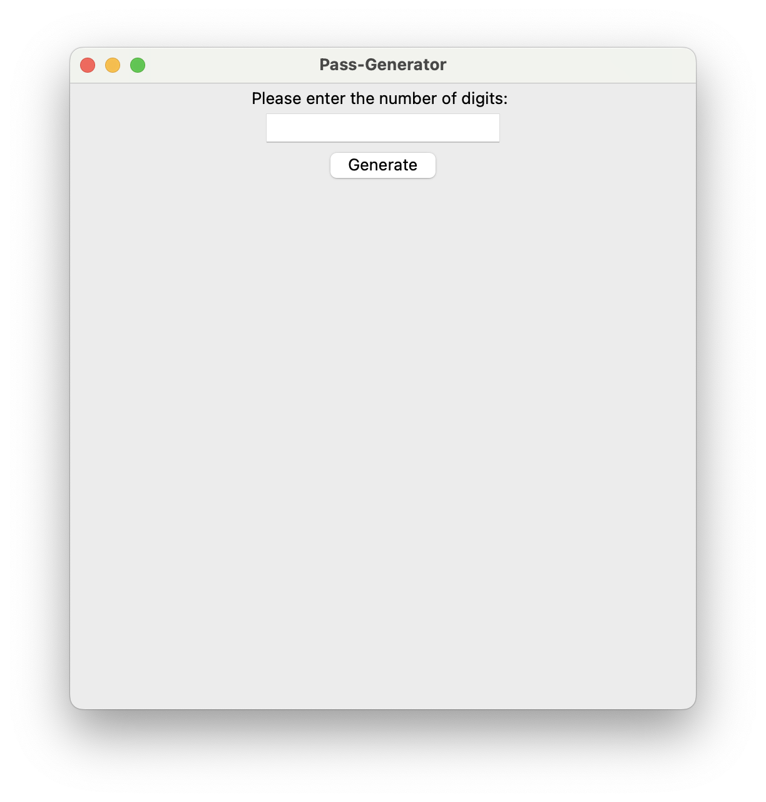

= Pass-Generator
:authors: Cloudberry Pi Foundations
:doctype: book
:toc: left
:icons: font
:source-highlighter: rouge
:sectnums:

== Overview

Pass-Generator is a lightweight desktop GUI application that generates random passwords and copies them to the clipboard. It uses Python's Tkinter for the interface and a separate `passwordcreate.py` module for password generation.

== Features

* Minimal, user-friendly Tkinter interface
* Specify password length with a single input
* Generates a random password using `passwordcreate.generate(length)`
* Automatically copies the generated password to the clipboard
* Informative success/error dialogs

== Screenshot

.App Window

== Quick start

1. Clone or download the repository.
2. Ensure the project contains:
* `generator.py` (the GUI)
* `passwordcreate.py` (must implement `generate(length)` and return a string)
* `key.png` (icon image) in the same folder
3. Install dependencies (if you use Pillow for PNG/JPG icons):

----
pip install pillow
----

4. Run:

----
python generator.py
----

== Usage

1. Open the app.
2. Enter the desired number of characters (for example, 12).
3. Click Generate.
4. A dialog confirms the password was generated and it is copied to your clipboard.

== Example passwordcreate.py

[source,python]
----
import random

def generate(length=12):
    chars = "abcdefghijklmnopqrstuvwxyzABCDEFGHIJKLMNOPQRSTUVWXYZ0123456789!@#$%^&*()-_=+"
    return "".join(random.choice(chars) for _ in range(int(length)))
----

== License

MIT License

== Contributing

Contributions, feedback, and stars are welcome — open a pull request or an issue.
